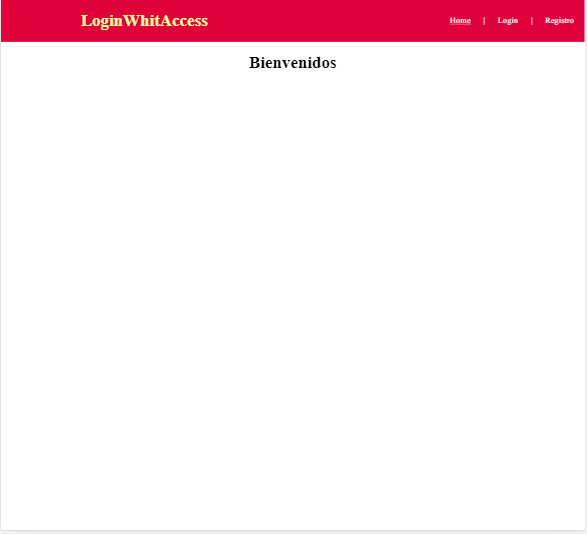
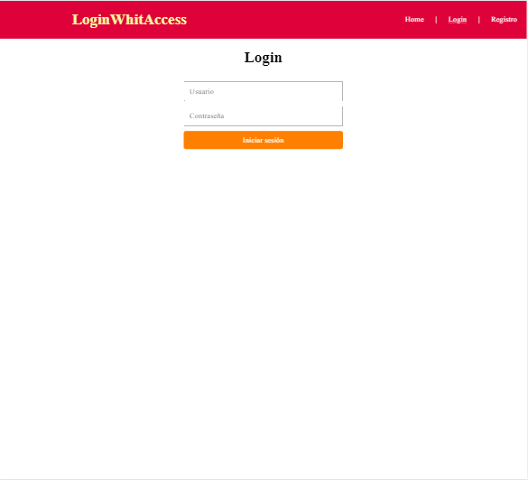
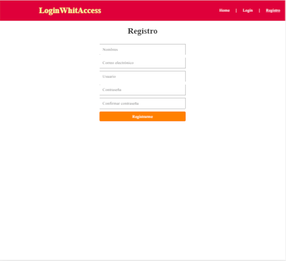
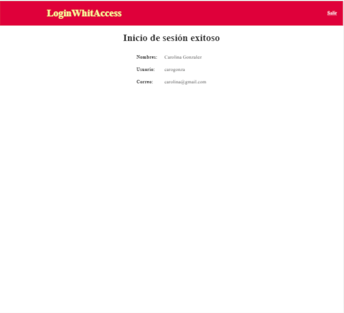

# Proyecto de login de usuarios
## Sencillo y simple con inicio de sesión de usuario

Se utilizaron las siguientes tecnologías:

* HTML
* CSS
* JavaScript (con peticiones ajax)
* PHP
* MYSQL

Se utiliza el modelo-vista-controlador en la estructura del proyecto, así como programación orientada a objetos.  
Maneja url amigable a través del archivo .htaccess.  
Solo tiene validaciones de los campos de los formularios en el front con JavaScript.

### ¿Cómo usarlo?
Se recomienda descargar el código fuente y moverlo a la carpeta htdoc (en el caso de usar xampp) o por el contrario en la carpeta 
proporcionada por el servicio de servidor que utilice el usuario.

Al levantar el servicio del servidor, con colocar en la barra de direcciones del navegador localhos/loginWithAccess se debería  
mostrar la página inicial.

Para poder realizar las pruebas de acceso a la zona de usuario, se debe crear la base de datos en MYSQL con los comandos proporcionados 
en la carpeta sql llamado "loginwithaccess_db.sql". Se puede usar mediante la importación directamente desde la página de phpmyadmin.

### Página inicial

### Página de login

### Página de registro de usuarios

### Página de acceso a la zona de usuario

El archivo core_app se definen las constantes de acceso vía localhost.

Los usuarios cargados en la base de datos como ejemplo son:

* Usuario: pedrogarcia / Contraseña: valencia (toda en minúscula)
* Usuario: carogonza / Contraseña: venezuela (todo en minúscula)

Se incluye en el proyecto un archivo sql con las consultas que se deben ejecutar en MYSQL para la creación y utilización de la base de datos.

No se ha colocado ninguna función de encriptación de datos o contraseña en el proyecto.  
Importante tomar en cuenta a la hora de poner este proyecto en produccción.

### Nota importante

Para probar este proyecto se debe hacer en un entorno de servidor (por ejemplo: xampp, wamp o liveserver en Visual Studio Code). 
Esto es necesario porque se ejecuta conexión a base de datos y peticiones ajax (con la API fecth).

El proyecto es adaptable y escalable a las necesidades particulares del usuario.

## Permiso de uso

Se concede permiso por la presente, libre de cargos, a cualquier persona que obtenga una copia de este  
código fuente y de los archivos asociados, a utilizarlo sin restricciones, incluyendo sin limitaciones los derechos  
a usar, copiar, modificar, fusionar o publicar dicho código fuente.

El código fuente aquí proporcionado se proporciona "como está", sin garantía de ningún tipo, expresa o implícitamente, incluyendo 
pero no limitado a garantías de comercialización.